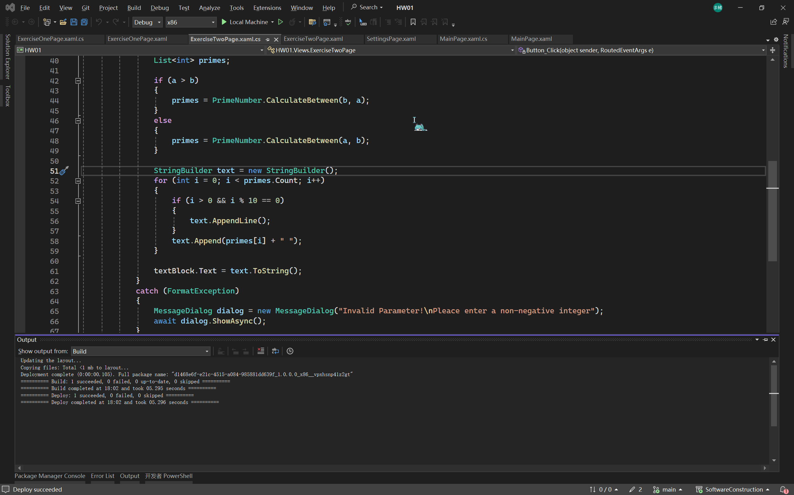
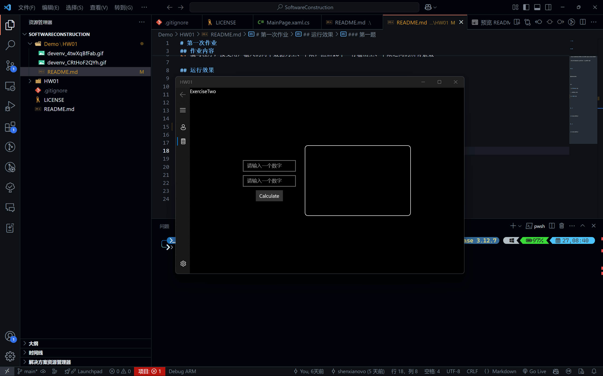

# 第一次作业

## 作业内容

1. 安装visual studio（2015以上版本），并编写hello world程序，要求输出：“你好！我是xxx”（xxx处用本人姓名代替）
2. 编写程序，接受用户输入的两个数据为上、下限，然后10个一行输出上、下限之间的所有素数

## 运行效果

如需本地安装，请下载源码。

下载后
1. 进入 `HW01/AppPackages` 目录。
2. 双击安全证书文件进行证书安装.
3. 运行 `MSIXBUNDLE` 安装包

### 第一题

### 第二题

