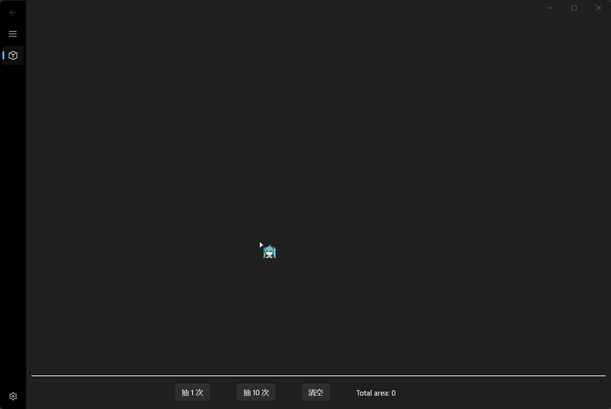
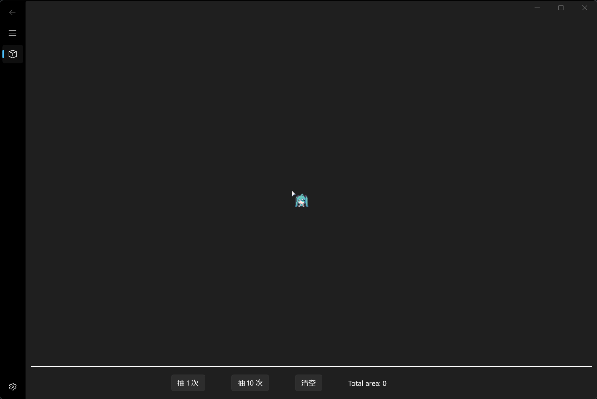
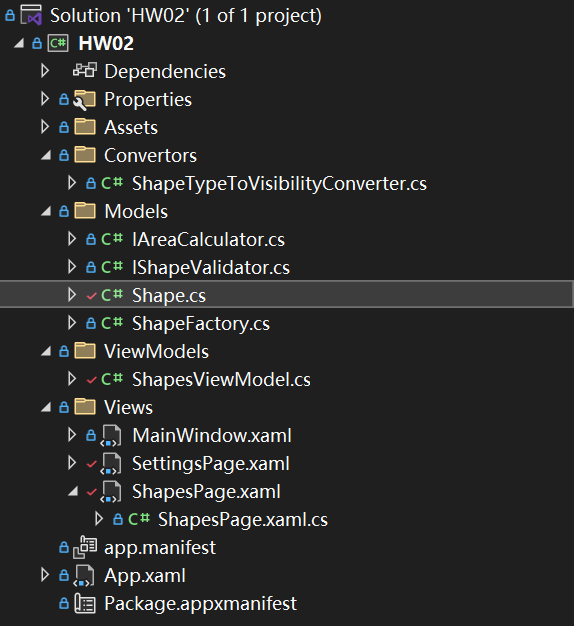

# 第二次作业

## 作业内容

1. 每个形状类都能计算面积、判断形状是否合法。请尝试合理使用接口/抽象类、属性来实现。
2. 随机创建10个形状对象，计算这些对象的面积之和。

## 运行效果

1. 实现了随机创建，绘制图形，计算面积，一键清除的功能
   - 
2. 每行显示的图形个数根据窗口宽度自动变化（每行最多绘制 5 个）
   - 
3. 最多存在10个图形，继续绘制会清除最先绘制的图形（类似队列）
   - 

## 源码分析

- 抽象基类 `Shape`, 继承两个接口 `IAreaCalculator` 与 `IShapeValidator`
- `Shapes` 派生出四种具体图形 `Rectangle`, `Square`, `Ellipse` 与 `Circle`
- 整个项目的架构... 尝试使用了 MVVM 模型...
  - 