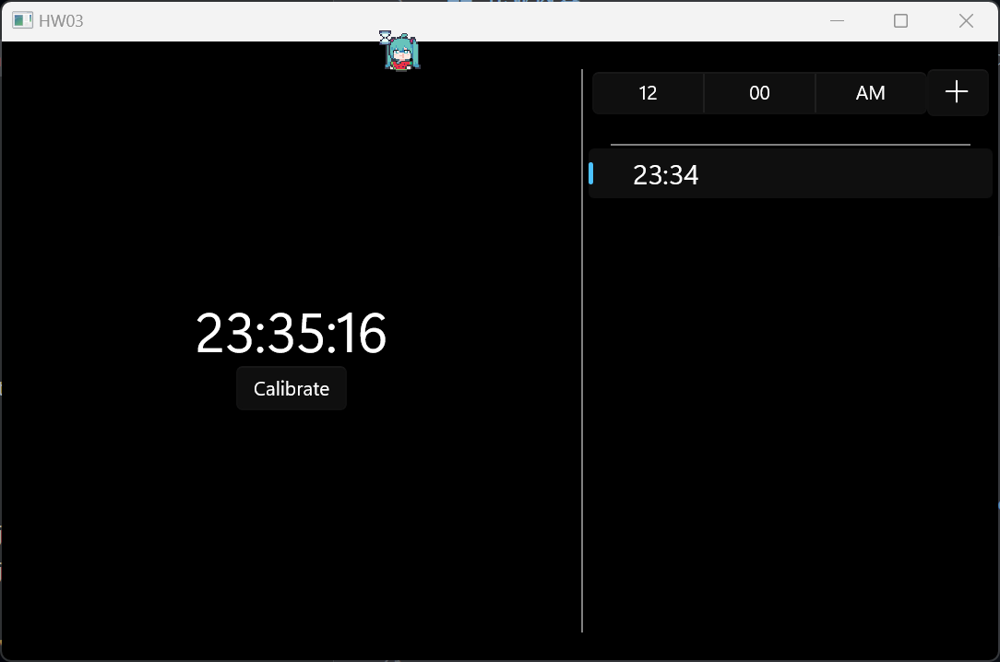
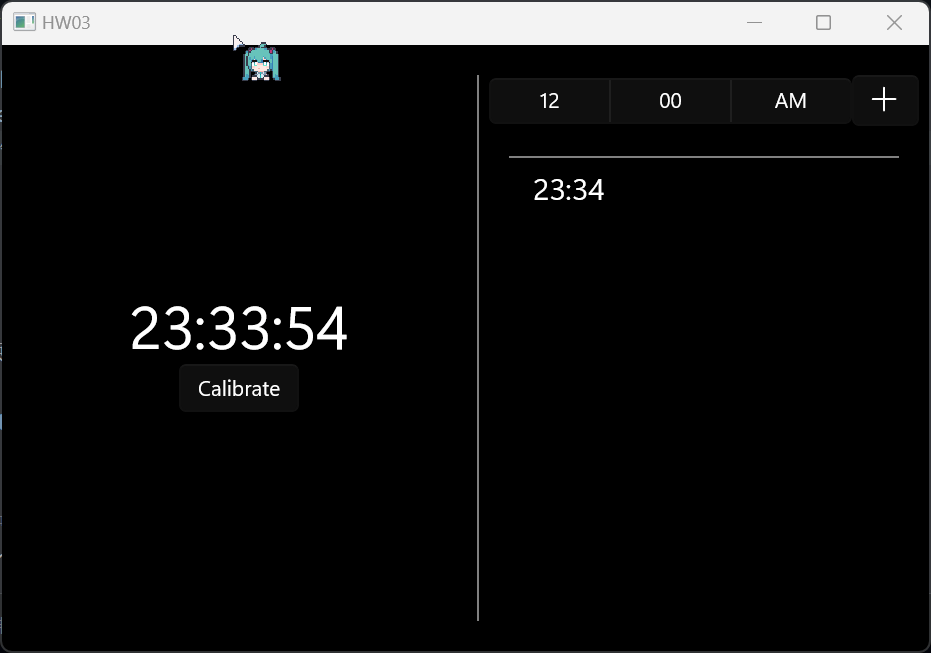
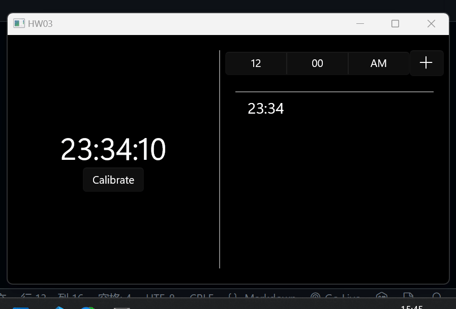
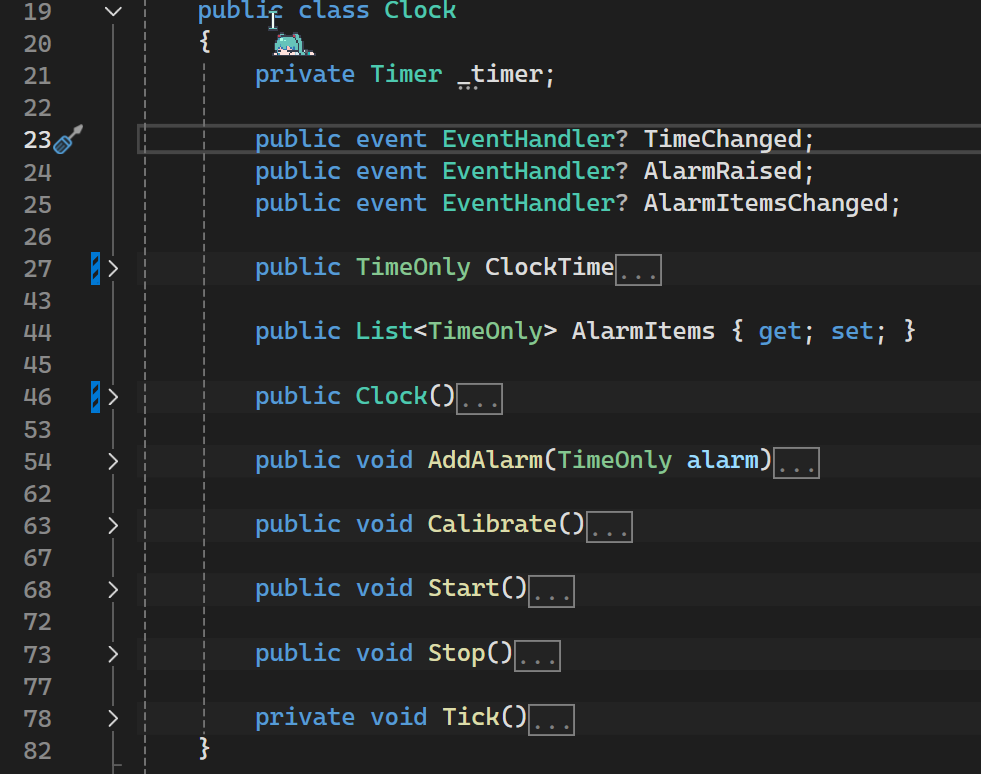
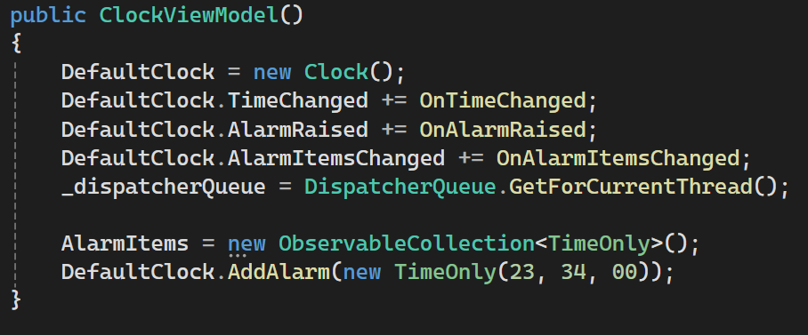

# 第三次作业

## 作业内容

1. 使用事件机制，模拟实现一个闹钟功能。闹钟可以有嘀嗒（Tick）事件和响铃（Alarm）两个事件。在闹钟走时时或者响铃时，在控制台/Winform界面上显示提示信息

## 运行效果

1. 实现了走时时对界面更新的事件
   
2. 实现了响铃时弹窗的事件
   
3. 实现了时钟校准与添加闹钟
   

## 实现思路

采用 MVVM 模型

1. `Clock` 类：
   - 实现了三个事件：走时，响铃与闹钟列表变化
   - 实现时钟基本行为
   
2. `ClockViewModel`：
   - 订阅事件
   


## 遇到的问题以及解决方式

八股部分结束，下面是遇到的一些问题

### 1. System.Runtime.InteropServices.COMException: ''

``` cs
// Model 中定义了事件
public event EventHandler? TimeChanged;

// ViewModel 中订阅了事件并封装了事件处理函数
private void OnTimeChanged(object? sender, EventArgs e)
{
    // 通知 UI 更新
    OnPropertyChanged(nameof(DefaultClockTime)); // 此处运行时报错
}
```

在多线程环境中更新UI元素时，可能会遇到该错误。

UI元素只能在创建它们的线程（通常是主线程）上进行更新

而Timer的回调方法是在一个线程池线程中执行的（非 UI 线程）

解决方案：

使用 DispacherQueue
``` cs
// ViewModel
private readonly DispatcherQueue _dispatcherQueue;
private void OnTimeChanged(object? sender, EventArgs e)
{
    _dispatcherQueue.TryEnqueue(() =>
    {
        // 通知 UI 更新
        OnPropertyChanged(nameof(DefaultClockTime));
    });
}
```

### 2. CsWinRT Error CS0227: Unsafe code may only appear if compiling with /unsafe

将下面的 `ObservableCollections` 字段更改为属性后出现上述报错。（更改为属性的原因是需要在 UI 中进行绑定）
``` cs
public ObservableCollection<TimeOnly> AlarmItems;
public ObservableCollection<TimeOnly> AlarmItems { get; set; } // 更改为属性后报错
```

STFW 后获取了一些资料:
- [一些资料](https://www.reddit.com/r/csharp/comments/1gpvdef/i_had_a_winui_3_application_using_c_12_and_net_8/)

开发者原话：
```
This is due to some generated code to marshal generic collections requiring unsafe blocks. 
You're getting that error because you're on an older version of CsWinRT. 
We've added a new analyzer for this to provide a better experience in the new release (2.2.1) 
```

2.2.0 版本的 `CsWinRt` 需要使用 `unsafe` 来进行代码生成。新版 (2.2.1) 似乎会解决这个问题 ~~但是目前还没发布...~~

解决方案：

在项目配置中启用 `unsafe block`

### 3. 弹窗 (ContentDialog) 需要指定 XamlRoot

``` cs
private void OnAlarmRaised(object? sender, EventArgs e)
{
    _dispatcherQueue.TryEnqueue(async () =>
    {
        ContentDialog dialog = new ContentDialog
        {
            Title = "Alarm",
            Content = "起きて",
            CloseButtonText = "OK"
        };

        // XamlRoot must be set in the case of a ContentDialog running in a Desktop app
        dialog.XamlRoot = ((Application.Current as App)?.m_window as MainWindow)?.Content.XamlRoot;

        var result = await dialog.ShowAsync();
    });
}
```

根据 MVVM 规范，ViewModel 不应有 UI-realated-code, ViewModel 与 UI 之间通过绑定与命令关联，
但是 `XamlRoot` 是 UI 里面的属性，WinUI3 没有提供这一属性的绑定方式...

通过`MainWindow.Current.Content.XamlRoot`运行时获取也不行，因为 MainWindow 由开发者自己创建，WinUI 不会自动存储 Current 实例，因此 Window.Current 始终为 `null`

理论上应该在 UI 创建时从 CodeBehind 里面拿到 `XamlRoot`，然而我的 ViewModel 根本就没放到 CodeBehind，是直接在 UI 中进行的实例化（天哪...

目前解决方法是把 `App` 中 `m_Window` 成员设置为公有，然后就有了这一长条恶心的东西（屎！）

``` cs
dialog.XamlRoot = ((Application.Current as App)?.m_window as MainWindow)?.Content.XamlRoot;
```
