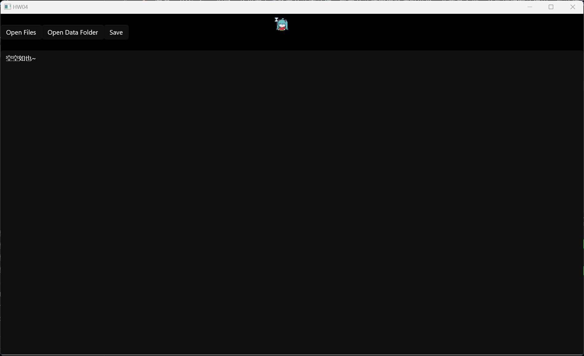
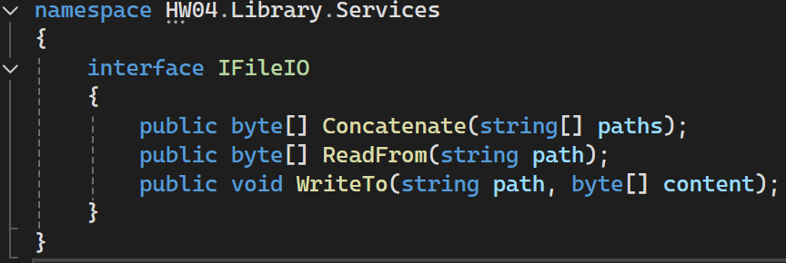
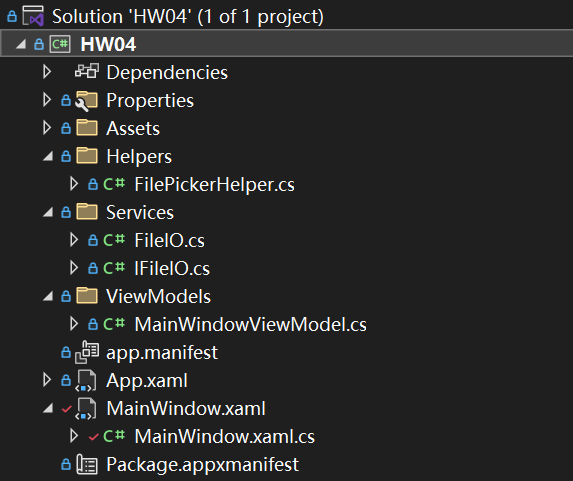

# 第四次作业

## 作业内容

1. 编写一个Winform程序，从界面上选择两个文本文件，将两个文件的内容读取出来，合并写入到一个新创建的文件中，新文件存放于可执行程序目录中的Data子目录里。

## 运行效果

1. 实现了多文件选取，合并；与合并后文件保存功能
   
2. 实现了一个操作提示文本框
   


## 实现思路

1. 封装了个文件操作接口 `IFileIO`
   

剩下就没什么好说的了，项目结构：



## 一些记录

### 1. filePicker

让你选文件的界面。有点像 Win32 API 的方式...

总之就是：
1. 先 `new()` 一个
2. 获取句柄
3. 其他设置

``` cs
// Create a file picker
var openPicker = new Windows.Storage.Pickers.FileOpenPicker();

// current WinUI 3 window handler.
var hWnd = WinRT.Interop.WindowNative.GetWindowHandle(window);

// Initialize the file picker with the window handle (HWND).
WinRT.Interop.InitializeWithWindow.Initialize(openPicker, hWnd);

// Set options for your file picker
openPicker.ViewMode = PickerViewMode.List;
openPicker.SuggestedStartLocation = PickerLocationId.Desktop;
openPicker.FileTypeFilter.Add("*");

// Open the picker for the user to pick a file
return await openPicker.PickMultipleFilesAsync();
```

### 2. 打开文件夹

直接开个进程

``` cs
using System.Diagnostics;

Process.Start(new ProcessStartInfo
{
   FileName = dataPath, // 文件夹路径 默认行为是在文件资源管理器中打开
   UseShellExecute = true,
   Verb = "open"
});
```