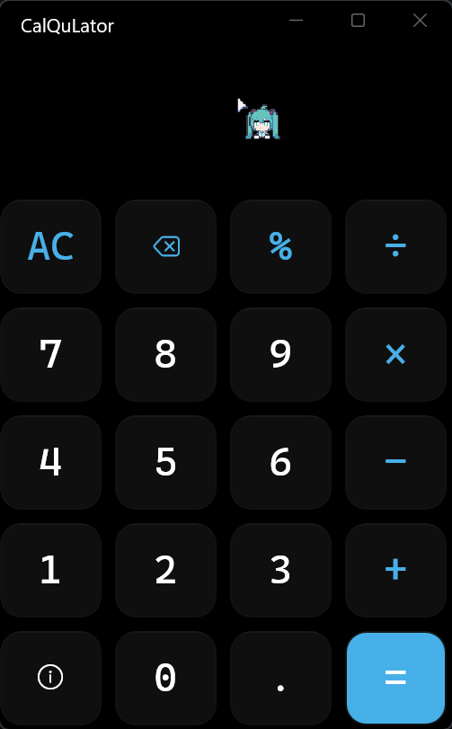
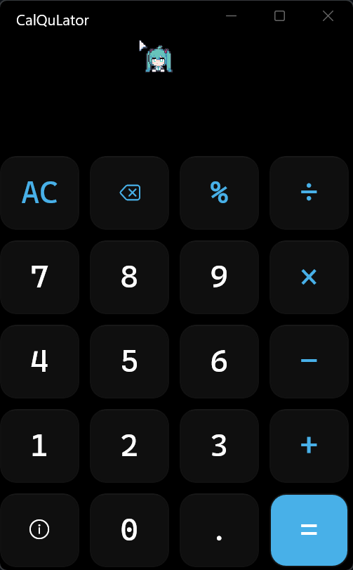
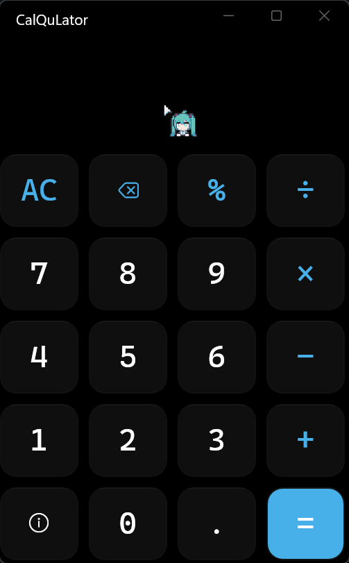
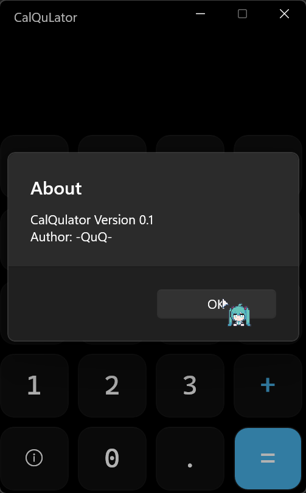
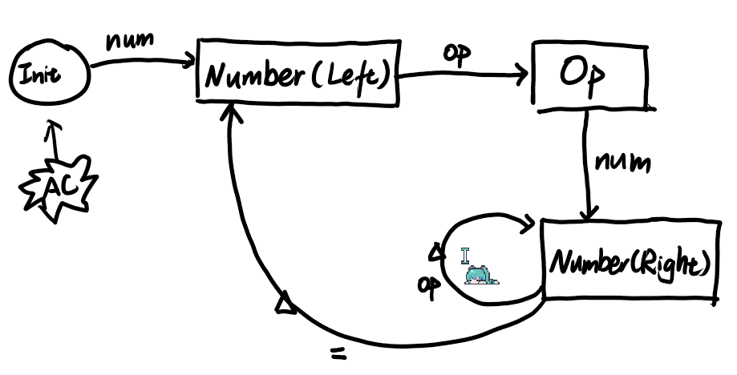
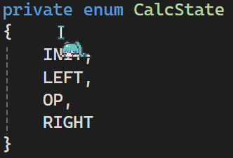
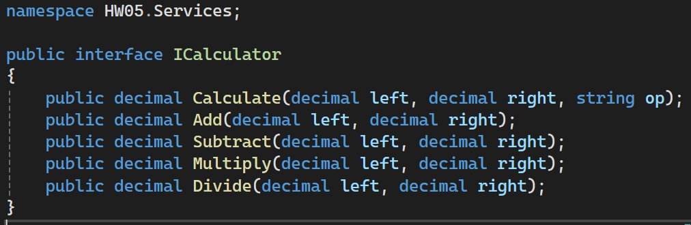
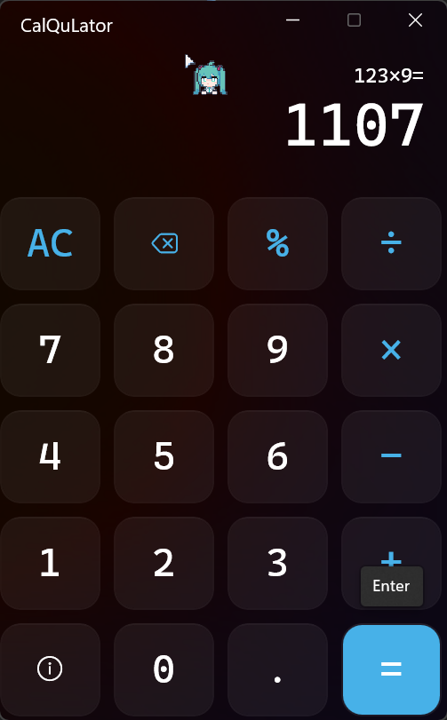

# 第五次作业

## 作业内容

1. 编写程序实现一个计算器，包括十个数字（0~9）按钮和四个运算符（加、减、乘、除）按钮，以及等号和清空两个辅助按钮，还有一个显示输入输出的文本框，显示表达式及结果如：18+5=23

## 运行效果

1. 实现了四则运算符，百分比，小数点和清零输入以及对应的键盘按键绑定

   
2. 实现了输入合法性检查（通过程序逻辑能完全避免非法输入与运行时检查）

   
3. 实现了连续运算

   
4. 实现了简易的 Info 界面

   

## 实现思路

1. 程序框架：MVVM + DI
   - 使用 .NET 通用主机作为 DI 容器
2. 程序逻辑：状态机
   - 四种 `CalcState`
     
     
3. 接口：`ICalculator`
   

## 遇到的问题

### 1. 按键绑定

xaml 中，绑定按键只需要设置 `KeyboardAccelerators` 属性就行

``` xml
<Button Grid.Row="4" Grid.Column="1" Content="0">
      <Button.KeyboardAccelerators>
         <KeyboardAccelerator Modifiers="None" Key="Number0"/>
         <KeyboardAccelerator Modifiers="None" Key="NumberPad0"/>
      </Button.KeyboardAccelerators>
</Button>
```

但是有些键盘的 `VirtualKey` 枚举值没定义，需要在 Code-Behind 里面用代码绑定

``` cs
// 键盘上的减号键
button.KeyboardAccelerators.Add(new KeyboardAccelerator
{
   Key = (VirtualKey)191
});
break;
```

### 2. 应用材质设置

xaml 中，设置 `SystemBackdrop`

``` xml
<Window.SystemBackdrop>
   <MicaBackdrop/>
</Window.SystemBackdrop>
```

Mica 材质简单说就是将你桌面背景模糊后应用到应用背景。所以应用的背景可以和你桌面背景保持一致

MicaAlt 会让桌面对应用的着色能力更强，但 需要在 Code-Behind 设置

``` cs
private void SetMicaBackdrop()
{
   if (Microsoft.UI.Composition.SystemBackdrops.MicaController.IsSupported())
   {
         MicaBackdrop micaBackdrop = new MicaBackdrop();
         micaBackdrop.Kind = Microsoft.UI.Composition.SystemBackdrops.MicaKind.BaseAlt;
         this.SystemBackdrop = micaBackdrop;
   }
}
```

Mica Alt效果：（我写完作业之后逛社区看到了，突然想起来可以加一个（）所以这个文档前面还是 Default Backdrop 的效果 ~~懒得重新录了~~）


