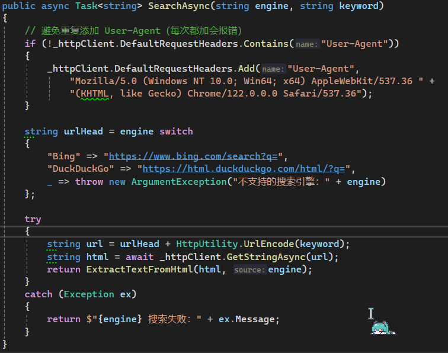

# 第七次作业

## 作业内容

1. 做一个窗体应用程序，接收用户输入的关键字，用户点击搜索时使用baidu，bing等搜索引擎搜索关键字，从搜索结果中，摘抄文字部分的前200个字，分别显示到两个多行文本框内。请使用多线程方式、并行编程或者异步编程方式完成任务。

## 运行效果

1. 实现了搜索与结果显示功能。选取搜索到的前五条结果
   

## 实现思路

1. 使用接口封装搜索函数
   
2. 使用异步编程方式进行请求，并进行了错误处理
   

## 遇到的问题

### 触发人机验证页面

加上请求头可以解决大多数情况

### 部分网页需要 JS 渲染才能返回结果

使用 html 版本的搜索引擎，比如用`https://html.duckduckgo.com/html`而不是`https://duckduckgo.com`

硬要说的话可以套一个WebView2控件(内置的Edge浏览器)，但是你塞个浏览器就完全没意义了...