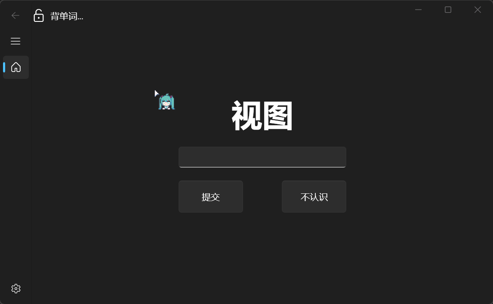
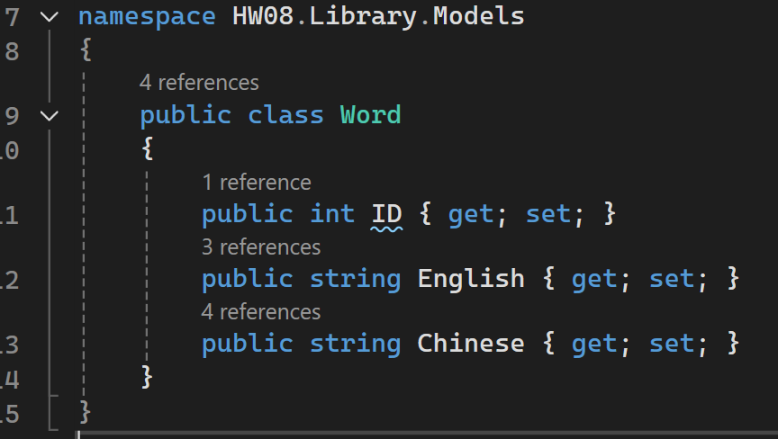
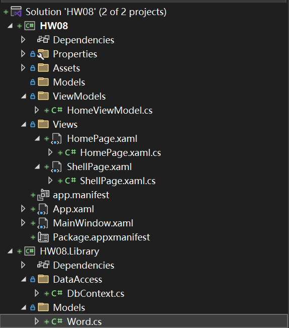

# 第七次作业

## 作业内容

1. 做一个小型背单词程序，使用数据库存储英文单词和中文词义。在Winform界面上依次显示英文单词的中文词义，用户可在编辑框中输入对应的英文单词，输入完毕后回车可与对应的英文单词进行比较，一致则显示"正确”，否则显示“错误”

## 运行效果

1. 实现了基本功能。提交后异步延时2s，以便查看结果
   

## 实现思路

1. 使用SQLite数据库。主键为单词ID，自增。
   
2. 程序框架：MVVM, 界面与后台分离。
   